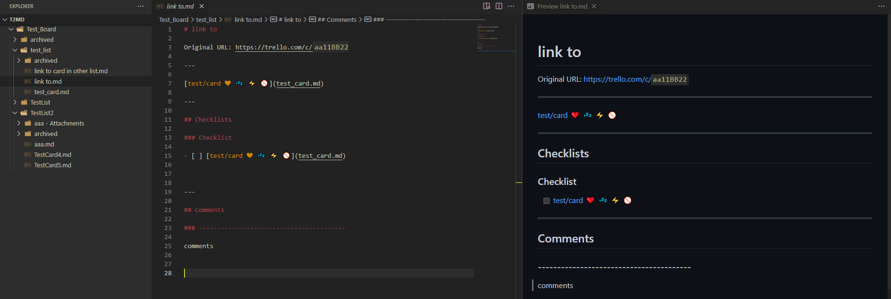
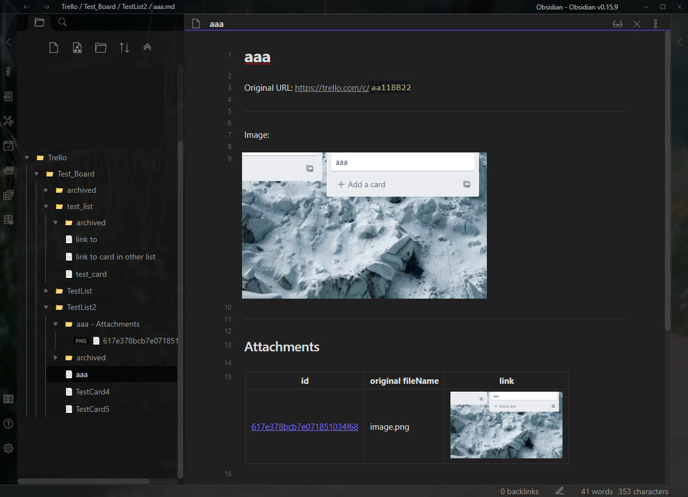

# Trello to Markdown

<p style="text-align: center">
  
</p>


`t2md` backs ups the full .json export of your Trello boards and all uploaded (not linked) attachments, then creates local markdown files for each card's description, checklists, comments and attachments for easy viewing. Any references to uploaded attachments in the description and comments are replaced with local relative paths so they continue to display. 

This allows you to preserve important info you store in Trello, view it locally, run fast full-text searches and even generate static sites of your Trello content.

It runs asynchronously which makes it pretty fast too. Both Windows and Linux single-file-binary (no .Net Core install required) builds are available.

**NEW:** The latest version (4+) now supports extra features to make exporting to Obsidian even easier. Create a single markdown file per card, disable number prefixes, replace Trello card links with local file links, always use forward slashes, show attachment previews and remove empty folders. See further down for details.

One example layout:

```
.
├── Board 1
│   ├── 0 example list
│   │   ├── 0 A simple Trello card - Attachments
│   │   │   ├── 617f9525fbac523d689a1b71.png
│   │   │   └── 617f9959deb5696a3dd6ce98.png
│   │   ├── 0 A simple Trello card - Attachments.md
│   │   ├── 0 A simple Trello card - Checklists.md
│   │   ├── 0 A simple Trello card - Comments.md
│   │   ├── 0 A simple Trello card - Description.md
│   │   ├── 1 Another card - Checklists.md
│   │   ├── 1 Another card - Comments.md
│   │   ├── 1 Another card - Description.md
│   │   └── archived
│   └── 1 another list in the board
│       └── ...
├── Board 2
│   └── ...
├── Board 1.json
└── Board 2.json
```

## Usage

- Run `t2md.exe --help` to see options
- Run `t2md.exe --output-folder <backup destination folder>` once to generate `t2md.json` in the current directory
- Browse to https://trello.com/app-key and copy your `Key`
- Replace `<key>` with it at the end of the following URL, browse to it and continue to retrieve your token
  - `https://trello.com/1/authorize?name=Trello%20To%20Markdown&expiration=never&scope=read&response_type=token&key=<key>`
- Put them both in `t2md.json`
- Run `t2md.exe --output-folder <backup destination folder>` again.
  A t2md subfolder will be created under this and all Trello boards will be backed up to it.
  - **WARNING:** The entire t2md subfolder will be deleted and recreated each time.

## Exporting to Obsidian or other knowledgebase formats

Run `t2md.exe --help` to see options to improve this. Recommended settings: 

- `--always-use-forward-slashes`
- `--no-numbering`
- `--max-card-filename-title-length 100`
- `--single-file`
- `--remove-empty-folders`

## Screenshots

<table>
  <tr>
    <td><a href="images/2022-09-23-17-16-21.png"></a></td>
    <td><a href="images/2022-09-23-17-21-41.png"></a></td>
  </tr>
</table>

## Videogames

Hey, do you like videogames? If so please check out my game **Grab n' Throw** on Steam, and add it to your wishlist. One gamemode is like dodgeball crossed with soccer except instead of balls you throw stacks of your own teammates. And there's plenty of others to come!

<p align="center">
  <a href=https://store.steampowered.com/app/1813590/Grab_n_Throw/?utm_source=github_t2md>
    
  </a>
</p>

[<p align="center">**See more on Steam**</p>](https://store.steampowered.com/app/1813590/Grab_n_Throw/?utm_source=github_t2md)
